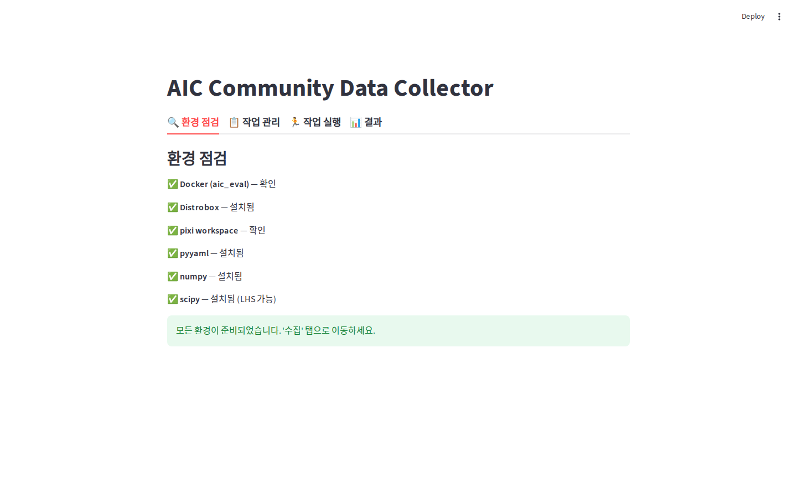
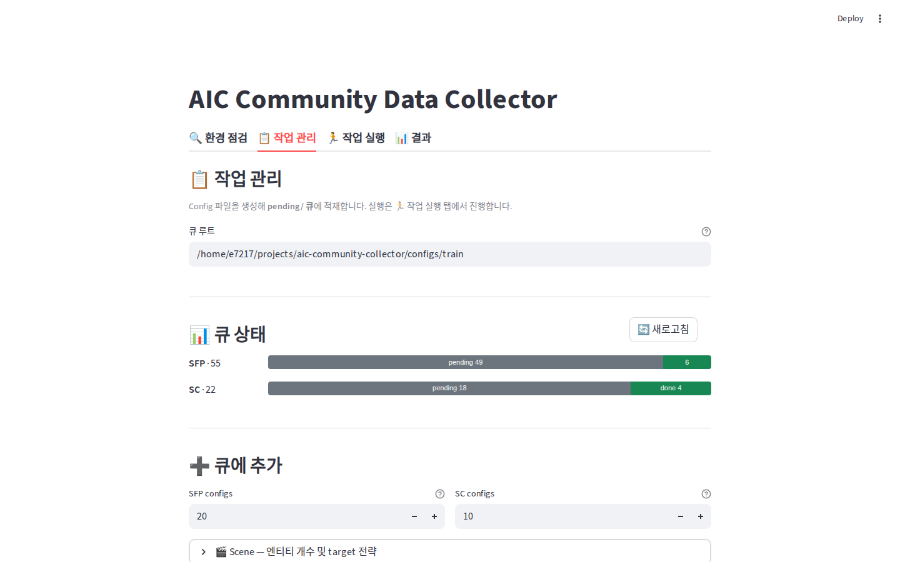
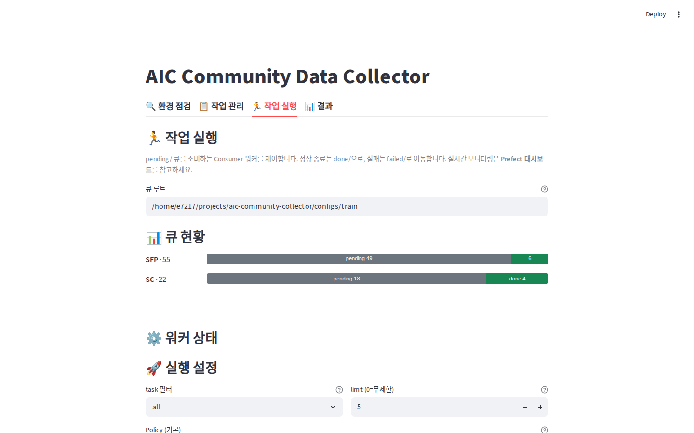
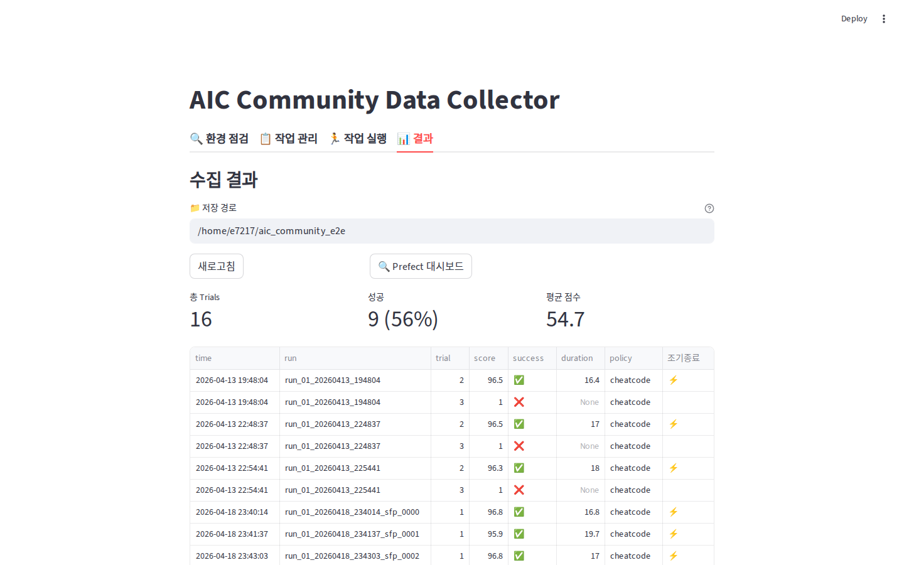
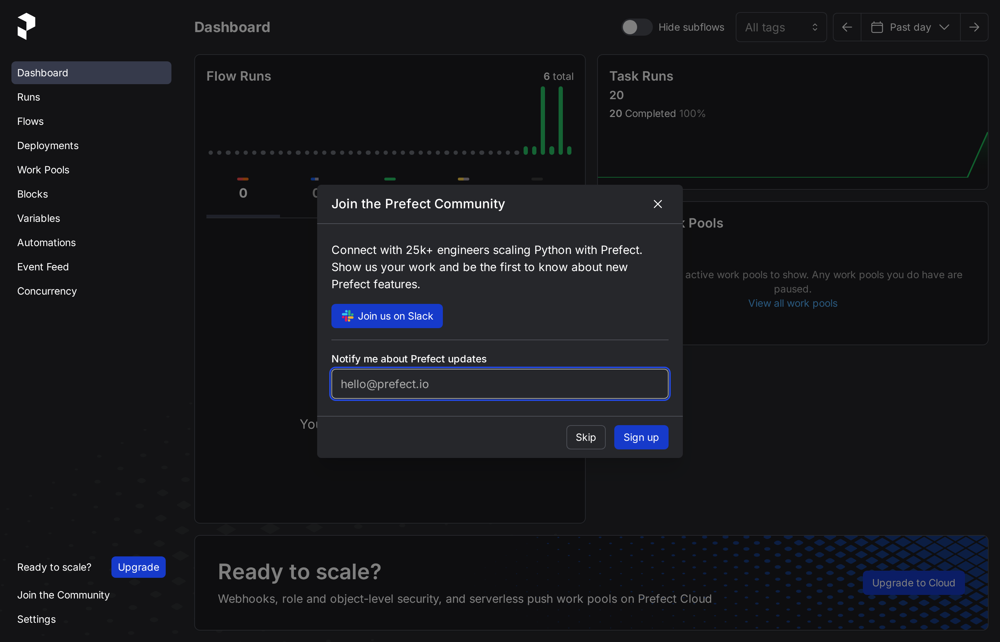
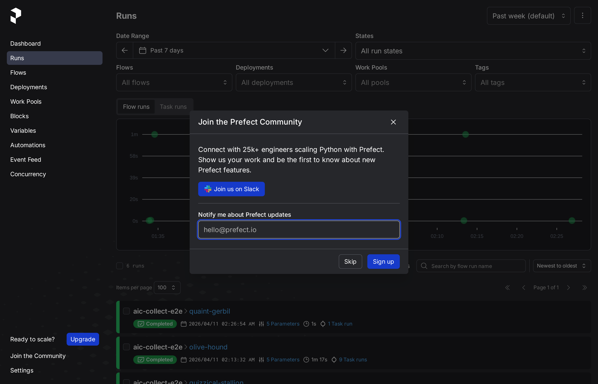
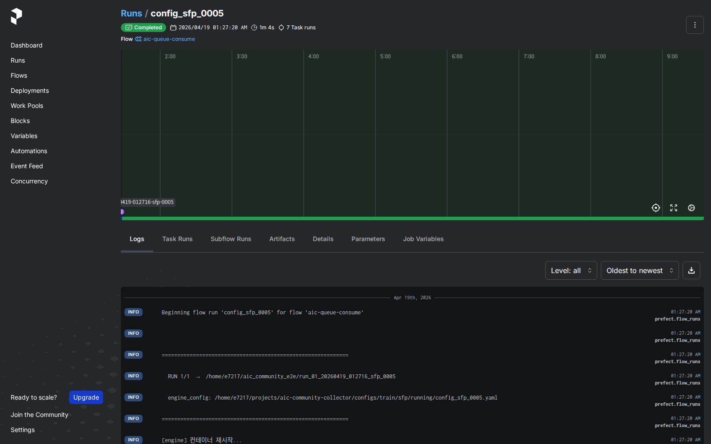
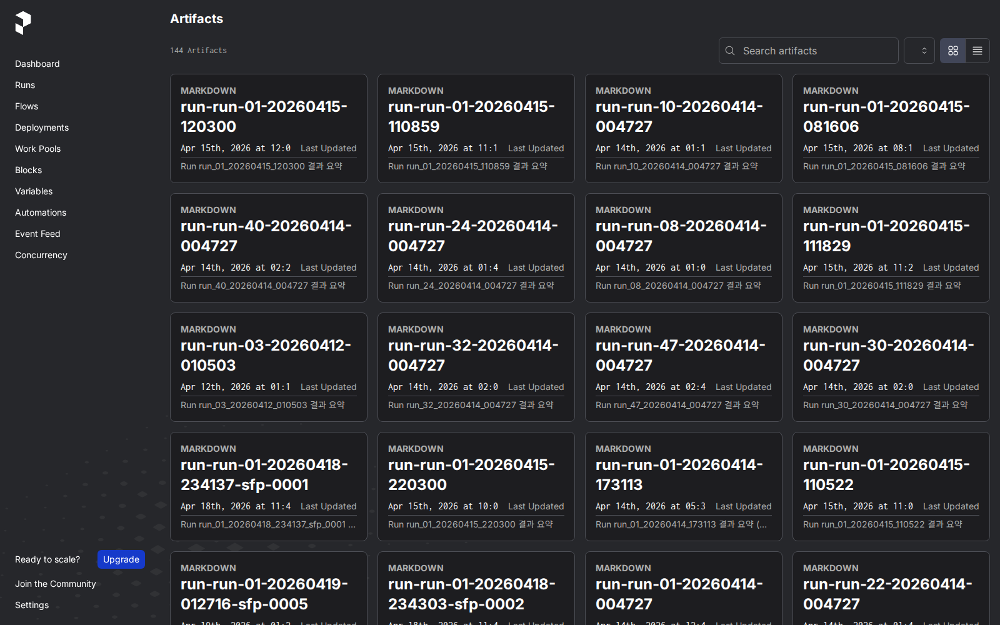
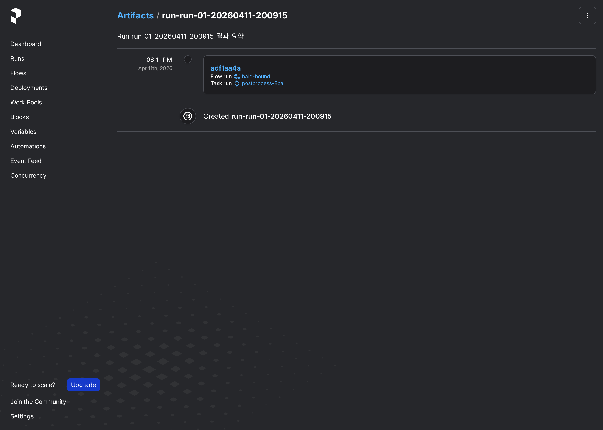

# 🤖 AIC Community Data Collector

**AIC (AI for Industry Challenge)** 대회에 참가하는 친구들이, **내가 만든 로봇 프로그램(Policy)** 으로 **평가 데이터를 자동으로 모아주는 도구**예요.

> 📘 자세한 단계별 안내는 [사용 가이드](docs/usage-guide.md), YAML 설정 항목 설명은 [Config Reference](docs/config-reference.md)에서 볼 수 있어요.

---

## 🎯 이 프로그램이 뭘 해 주나요?

로봇 시뮬레이터로 **수십~수백 번의 실험을 자동으로 돌리고, 점수를 모아서 표로 보여주는 프로그램**이에요.

### 🍳 비유: "자동 부엌"

| 단계 | 이름 | 하는 일 |
|---|---|---|
| 1️⃣ | **작업 관리 (Producer)** | 주문서(YAML 파일)를 만들어서 **대기 폴더**에 쌓아둠 |
| 2️⃣ | **작업 실행 (Consumer)** | Worker(요리사)가 주문서를 하나씩 꺼내서 로봇 시뮬레이터로 실행 |
| 3️⃣ | **결과 보기** | 어떤 주문이 성공했는지 점수와 함께 표로 보여줌 |

주문서 만드는 일과 실행하는 일을 **일부러 나눴어요**. 왜냐하면:

- 주문서는 수백 개를 한 번에 쌓아두고, **요리사가 자기 속도로 하나씩 처리** 가능
- 중간에 컴퓨터가 꺼져도 **주문서는 안 사라져요** (pending 폴더에 남아 있음)
- 주문 만드는 사람과 실행하는 사람이 달라도 됨

---

## 🛠 시작하기 전에 필요한 것

대회 참가자라면 보통 다 깔려 있을 거예요. 없다면 [AIC Getting Started](https://github.com/intrinsic-dev/aic/blob/main/docs/getting_started.md)를 따라가세요.

- 🐳 **Docker** + `aic_eval` 컨테이너 (내가 `docker` 그룹에 속해 있어야 해요)
- 📦 **Distrobox**
- 🌿 **pixi** + `~/ws_aic/src/aic`
- ⚡ **uv** — Python 패키지 관리 도구
  ```bash
  curl -LsSf https://astral.sh/uv/install.sh | sh
  ```

---

## 🚀 빠르게 시작하기

```bash
# 1. 이 저장소 내려받기
git clone https://github.com/e7217/aic-community-collector
cd aic-community-collector

# 2. (선택) 내가 만든 Policy 파일을 policies/ 폴더에 넣기

# 3. 웹 화면 열기
uv run src/aic_collector/webapp.py
```

브라우저에서 `http://localhost:8501`에 접속하면 **4개 탭**이 보여요:

🔍 환경 점검 · 📋 작업 관리 · 🏃 작업 실행 · 📊 결과

---

## 🤖 Claude Code / Codex로 자동 수집하기

UI나 CLI를 외우기 귀찮다면, **Claude Code**(또는 Codex) 에서 자연어로 시킬 수 있어요. 이 저장소는 `.claude/skills/aic-collect/` 에 **aic-collect 스킬**을 담고 있어서, AI 에이전트가 자동으로 활성화돼 환경 점검 → 큐 생성 → 워커 실행 → 결과 요약까지 대신 해줍니다.

### 시연 영상

<video src="docs/llm-test.mp4" controls width="720" muted>
  이 브라우저에서는 영상이 재생되지 않습니다. <a href="docs/llm-test.mp4">직접 다운로드 / 재생</a>
</video>

> 영상이 인라인 재생되지 않으면 [▶ docs/llm-test.mp4](docs/llm-test.mp4) 링크를 눌러 보세요.

### 쓰는 법

1. 저장소를 연 Claude Code에 자연어로 요청:
   - "테스트용으로 SFP 4개 정도 수집해줘"
   - "NIC 카드 3개로 고정해서 학습 데이터 20개 만들어줘"
   - "수집 실패했는데 원인 찾아줘"
2. 스킬이 자동으로 활성화되어 필요한 값만 한 번 되묻고 나머지는 알아서 진행합니다.
3. 진행하면서 각 단계의 **실제 명령어**를 함께 보여주므로, 나중에 직접 하고 싶어지면 그대로 복붙하면 됩니다.

자세한 스킬 동작 규약은 [`.claude/skills/aic-collect/SKILL.md`](.claude/skills/aic-collect/SKILL.md) 참고.

### Gemini / Codex 등 다른 에이전트를 쓸 때

Claude Code는 `.claude/` 디렉토리를 자동으로 읽지만, **Gemini CLI·Codex 등은 `.agents/` 규약**을 따릅니다. 다음 중 하나로 맞춰주세요:

```bash
# 심볼릭 링크 (권장 — 한 쪽만 관리)
ln -s .claude .agents

# 또는 복사 (별도 관리가 필요하면)
cp -r .claude .agents
```

스킬 본문(`SKILL.md`)과 커맨드(`commands/`) 파일 포맷은 에이전트 간 공통이라 그대로 동작합니다.

---

## 🔍 1. 환경 점검 탭

**시작할 때 한 번만 하면 되는 건강검진**이에요. 필요한 프로그램이 잘 깔려 있는지 확인해 줘요.



- ✅ **초록색 체크** → 통과, 그냥 넘어가기
- ❌ **빨간 X** → 뭔가 빠졌어요. 옆에 **[설치]** 버튼이 나오면 눌러서 자동 설치
- ⚠️ **경고** → 수동 설치 필요 (필요한 명령어가 표시돼요)

모두 초록불이 되면 다음 탭으로 이동!

---

## 📋 2. 작업 관리 탭 — 주문서 만들기

로봇이 할 일을 **YAML 설정 파일**로 만들어서 `pending/` 폴더에 쌓아두는 곳이에요.



### 📊 큐 상태 막대

각 Task(SFP, SC)마다 현재 주문서가 어느 상태에 몇 개씩 있는지 막대로 보여줘요:

- 🟡 **pending** — 아직 실행 안 된 주문서
- 🔵 **running** — 지금 실행 중
- 🟢 **done** — 성공 완료
- 🔴 **failed** — 실패

### ➕ 큐에 추가

두 종류의 Task를 만들 수 있어요:

- **SFP** — 네트워크 카드(NIC)에 케이블 꽂기 (5 rail × 2 port = **10종 목표**)
- **SC** — SC 포트에 연결하기 (rail 0·1 = **2종 목표**)

#### 🎬 Scene 설정 (씬 구성)

- **엔티티 개수** — 화면에 놓을 NIC 카드(1~5개), SC 포트(1~2개) 개수
  - "고정 개수" ON → 매번 정확히 N개
  - OFF → 1~N개 사이에서 랜덤
- **Target cycling** — 10종·2종 목표를 **순서대로 돌려가며** 공평하게 뽑아줘요

#### 📏 Parameters — 랜덤화 범위

케이블 위치(translation), 회전(yaw), 그리퍼 오차(gripper offset) 같은 숫자의 **랜덤 범위**를 정해요.

> ⚠️ 슬라이더 최댓값 = **AIC 공식 문서의 허용 최대 범위**예요. 이걸 넘게 설정 못 하게 막혀 있어요.

**샘플링 전략**:
- **uniform** (기본) — 매번 독립적으로 무작위
- **lhs** — 공간을 고르게 채우는 똑똑한 랜덤 (샘플 수 적을 때 유리)

### 📁 큐 폴더 구조

```
configs/train/
  ├─ sfp/
  │   ├─ pending/   ← 주문서 대기소 (Producer가 여기 넣음)
  │   ├─ running/   ← 지금 요리 중인 주문
  │   ├─ done/      ← 성공해서 이동된 주문서
  │   └─ failed/    ← 실패해서 이동된 주문서
  └─ sc/ (똑같은 구조)
```

### 🧠 내 Policy 사용하기

1. `policies/` 폴더에 Python 파일 추가
2. `aic_model.policy.Policy`를 상속받고 `insert_cable()` 함수 구현
3. 작업 실행 탭 드롭다운에서 자동으로 선택 가능!

---

## 🏃 3. 작업 실행 탭 — 요리사가 주문 처리

`pending/`에 쌓인 주문서를 하나씩 꺼내서 **진짜로 시뮬레이터를 돌리는** 곳이에요.



### 🚀 실행 설정

| 옵션 | 뜻 |
|---|---|
| **task 필터** | `all` / `sfp` / `sc` — 어떤 종류를 처리할지 |
| **limit** | 최대 몇 개까지 처리할지 (`0` = 다 끝날 때까지) |
| **Policy** | 어떤 Policy로 돌릴지 선택 |
| **SFP/SC 분리** | 체크하면 task마다 **다른 Policy** 사용 가능 |
| **timeout** | 주문 하나가 너무 오래 걸리면 실패 처리할 시간 |
| **ground_truth** | 정답 좌표 제공 여부 (OFF면 Policy가 순수 추정) |

### ⚙ 실행 중 화면

워커가 일하는 동안 **3초마다 자동으로 갱신**돼요:

- 📊 **진행률 막대** — 처리한 개수 / 전체 개수
- ⏱ **ETA (남은 시간)** — "평균 N초/config" 기준으로 예상
- 🔹 **현재 실행 중** config 이름과 경과 시간
- ✅/❌ **최근 처리 목록** — 방금 끝난 주문들의 성공/실패
- ⏹ **워커 정지** 버튼 — 지금 실행 중인 건 끝낸 뒤 깔끔하게 종료

### 🚨 복구 기능

컴퓨터가 갑자기 꺼졌다면 `running/`에 파일이 남아 있을 수 있어요. **[복구]** 버튼(또는 CLI의 `--recover`)을 쓰면 자동으로 `pending/`으로 되돌려 줘요.

---

## 📊 4. 결과 탭



실행이 끝나면 여기서 한눈에 볼 수 있어요:

- 🔢 **총 Trial 개수**, **성공률**, **평균 점수**를 숫자 카드로 요약
- 📋 각 trial별 점수를 **표**로 보기
- 📥 **CSV 다운로드** — 엑셀이나 구글 스프레드시트에서 열 수 있음
- 🗑 **결과 폴더 삭제** — 실수 방지 경고 있음

### ⚠️ 검증 경고가 있을 때

수집된 데이터에 이상이 있으면(예: 씬 파라미터가 기대와 다름) 테이블 아래에 **검증 경고** expander가 열려요. 어느 run의 어떤 체크가 실패했는지 펼쳐서 확인할 수 있어요.

### 📁 결과 폴더 구조

큐 모드(1 config = 1 trial)는 **평탄 구조**로 저장됩니다:

```
~/aic_community_e2e/
└── run_20260419_101852_sfp_0006/
    ├── config.yaml           # 실제 사용된 엔진 config
    ├── policy.txt            # 사용된 policy
    ├── seed.txt              # 샘플링 seed
    ├── scoring_run.yaml      # 엔진 원본 scoring (전체)
    ├── trial_scoring.yaml    # trial 단독 추출 scoring
    ├── tags.json             # 태그/메타데이터
    ├── validation.json       # 구조/크기 검증 결과
    ├── bag/                  # ROS bag 로그 (mcap + metadata)
    └── episode/              # collect_episode=ON일 때만 (PNG + npy)
```

Legacy Sweep 모드(다중 trial)는 여전히 `trial_N_scoreNNN/` 래퍼를 사용합니다:

```
run_01_20260408_234406/
├── config.yaml
├── trial_1_score95/
├── trial_2_score95/
└── trial_3_score25/
```

---

## 📈 Prefect 대시보드로 자세히 보기

내부적으로 **Prefect**라는 워크플로우 엔진을 써요. 실행 이력과 로그를 더 자세히 보고 싶으면 브라우저에서:

```
http://localhost:4200
```

### 메인 대시보드


### Runs — 지금까지의 모든 실행 목록


### Flow 상세 — 단계별 진행 상황과 걸린 시간


### Artifacts — 실행이 만들어낸 결과물 링크



---

## 💻 명령줄(CLI)에서 쓰기

웹 화면 없이 터미널에서 바로 돌리고 싶을 때:

### 큐 소비 워커 (권장)

```bash
# pending/의 모든 config를 cheatcode policy로 소비
uv run aic-collector-worker --root configs/train --task all \
    --policy cheatcode --output-root ~/aic_data

# SFP만 5개, 주문서당 최대 5분(300초)까지만
uv run aic-collector-worker --root configs/train --task sfp \
    --limit 5 --timeout 300

# 비정상 종료로 running/에 남은 파일 복구 후 실행
uv run aic-collector-worker --root configs/train --recover

# SFP는 내 policy, SC는 cheatcode로 분리 실행
uv run aic-collector-worker --root configs/train \
    --policy-sfp MyVisionPolicy --policy-sc cheatcode
```

### 단일 config 실행

```bash
uv run aic-prefect-run \
    --engine-config configs/train/sfp/pending/config_sfp_0050.yaml \
    --policy cheatcode --output-root ~/aic_data
```

---

## 📚 더 알아보기

- [사용 가이드](docs/usage-guide.md) — 단계별 사용법, 문제 해결 팁
- [Config Reference](docs/config-reference.md) — YAML 파일의 모든 항목 설명
- [AIC 공식 문서](https://github.com/intrinsic-dev/aic) — Task 구조와 파라미터 범위의 근거

## 🙋 막히면 어떡하지?

1. **환경 점검 탭**에서 빨간 X가 있는지 먼저 확인
2. `/tmp/aic_worker_run.log` 로그 파일 열어 보기
3. GitHub Issues에 질문 올리기

## 📄 License

MIT — see [LICENSE](LICENSE).

---

Created by **Changyong Um** ([@e7217](https://github.com/e7217), e7217@naver.com).
